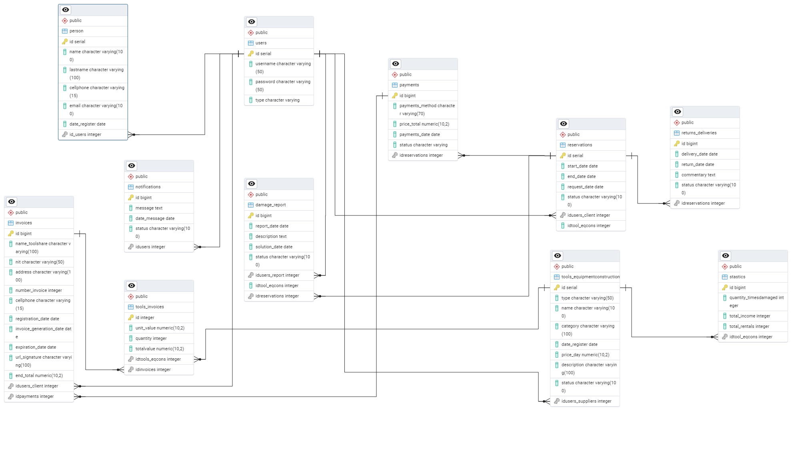

<h1 align= "center">🛠️ Plataforma de Renta de Herramientas y Equipos de Construcción</h1>

Realización del proyecto final con Campuslands; desarrollado con Spring Boot para facilitar el alquiler eficiente de herramientas y maquinaria de construcción por parte de contratistas, empresas y usuarios particulares...

## Tabla de contenido

- [Descripción](#descripción)
- [Tecnologías utilizadas](#tecnologías-utilizadas)
    - [Backend](#backend)
    - [Frontend](#frontend)
- [Estructura del proyecto](#estructura-del-proyecto)
- [Entidades](#entidades)
- [Diagrama de base de datos relacional](#diagrama-de-base-de-datos-relacional)
- [Diagrama UML](#diagrama-uml)
- [Características](#características)
- [Instrucciones de Ejecución del proyecto](#instrucciones-de-ejecución-del-proyecto)
- [Desarrollado por](#desarrolado-por)

## 📌Descripción

El presente proyecto se realizó debido a que el proceso de alquiler de herramientas suele ser poco automatizado y difícil de escalar. La plataforma busca resolver ese problema, facilitando el registro de inventario por parte de los proveedores y permitir a los clientes alquilar, pagar y gestionar reservas de forma eficiente, segura y ordenada.

## ✅ Tecnologías Utilizadas

### 🔧 Backend

### 🎨 Frontend

## Estructura del Proyecto

## Entidades

1. Damage Report
2. Invoices
3. Notifications
4. Payments
5. Persons
6. Reservations
7. ReturnsDeliveries
8. Stastics
9. ToolsEquipmentConstruction
10. ToolsInvoices
11. Users

## Diagrama de base de datos relacional

## Diagrama UML

## Características

El proyecto ha sido organizado utilizando la arquitectura Modelo-Vista-Controlador (MVC), lo que permite una separación clara de responsabilidades entre el backend y el frontend, distribuidos en carpetas y archivos específicos:

La carpeta [Application]: Esta carpeta contiene la estructura principal de la lógica de negocio de la aplicación.
- La carpeta[Service]: Esta carpeta incluye en los archivos todas las interfaces Service correspondientes a las distintas entidades del sistema, estas definen los métodos que encapsulan la lógica de la plataforma de renta y que serán implementados posteriormente en las clases ServiceImpl.

La carpeta [Config]: Esta carpeta contiene dos archivos [.java] que gestionan la configuración de seguridad del sistema. En ellos se define el control de acceso según los distintos roles (Admin, Supplier y Customer) y se implementa la generación y validación de tokens para autenticar y autorizar el acceso a los recursos protegidos.

La carpeta [Domain]: Esta carpeta nos permite almacenar en los archivos todos los atributos de las entidades de la BBDD, en ella también tenemos 4 carpetas más:

- La carpeta [Dto]: Esta carpeta nos permite encapsular y simplificar en archivos los datos de una entidad. Tambien nos ayuda a manejar de manera más ligera y rápida los atributos extrictamente necesarios para la función y ejecución del código.
- La carpeta [Enum]: Esta carpeta nos permite organizar en archivos los enums utilizados en las entidades de nuestro proyecto en una sola parte. Esto nos ayuda en la mejora de la estructura del código, nos es útil para representar los estados, roles, categorías, etc, de una manera más clara y segura.
- La carpeta [Request]: Esta carpeta nos permite organizar en los archivos todas las clases que definen la estructura de los datos entrantes, separándolos de las entidades del sistema y de otros tipos de DTOs.
- La carpeta [Response]: Esta carpeta nos almacena los archivos que nos permitiran modelar la respuesta que enviamos de la API al frontend, separando las estructuras de las entidades del sistema y de las clases request.

La carpeta [Infraestructure]: Nos guarda dos carpetas esenciales del código:

- La carpeta [Controller]: Esta carpeta nos permite, mediante los archivos poder manejar las solicitudes (HTTP) entrantes desde los roles (Admin, Supplier y Customer).
- La carpeta [Repository]: Esta carpeta es la encargada de guardar las interfaces responsables de la persistencia de datos(consultas, inserciones, actualizaciones y borrados), la que se comunica directamente con la base de datos. Dentro de esta carpeta se incluye también:
    - La carpeta [RepositoryImpl]: Esta subcarpeta contiene los archivos con las implementaciones personalizadas de los repositorios. Las clases en esta carpeta implementan interfaces personalizadas y utilizan @Service para interactuar directamente con la base de datos.

La carpeta [JWT]: Esta carpeta nos permite crear el filtro de autenticación de la seguridad.

## ⚙️ Instrucciones de Ejecución del proyecto

### 1. Clonar el repositorio

https://github.com/MariaGLi/FerreteriaLosM_LizarazoMaria_LassoValerie_CaicedoLuis.git

### 2. Importar el proyecto como Maven en tu IDE preferido

### 3. Configurar PostgreSQL y ejecutar los scripts SQL ubicados en /sql

### 4. Configurar el archivo application.properties

### 5. Ejecutar la aplicación desde tu IDE o con el siguiente comando:
./mvnw spring-boot:run

## Desarrolado por:
Proyecto realizado por María Guadalupe Lizarazo Leal, Valerie Michell Lasso y Luis Miguel Caicedo Bermón, estudiantes de Campus-Lands como filtro previo a la evaluación final de este módulo.

## Contacto de los desarrolladores:

* mlizarazoleal@gmail.com
* valerie01liz01@gmail.com
* luis@gmail.com