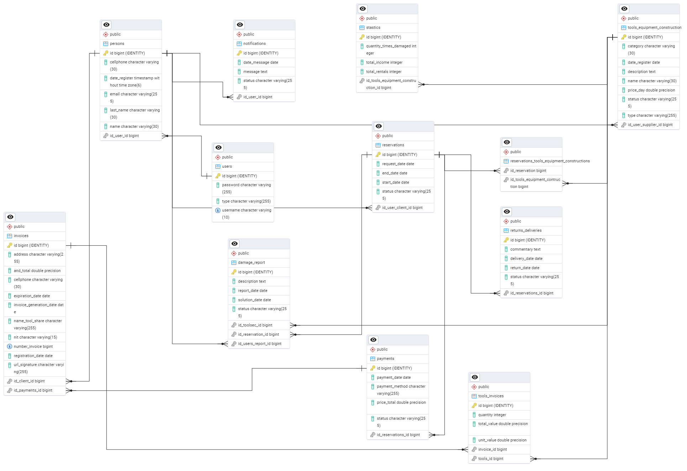

<h1 align= "center">🛠️ Plataforma de Renta de Herramientas y Equipos de Construcción</h1>

Realización del proyecto final con Campuslands; desarrollado con Spring Boot para facilitar el alquiler eficiente de herramientas y maquinaria de construcción por parte de contratistas, empresas y usuarios particulares...

## 📌Descripción

La Plataforma de Renta de Herramientas y Equipos de Construcción es una aplicación web desarrollada con Spring Boot y PostgreSQL que automatiza el proceso de alquiler de herramientas entre clientes, proveedores y el administrador. El objetivo es modernizar la gestión de inventario, reservas, pagos y devoluciones, eliminando procesos manuales y mejorando la eficiencia operativa.

El sistema permite a los proveedores registrar herramientas con disponibilidad y precios, mientras que los clientes pueden explorar el catálogo, realizar reservas, efectuar pagos en línea y recibir notificaciones. Por otra parte, el administrador supervisa toda la operación, gestiona usuarios, genera reportes y monitorea la facturación.

Este proyecto lo divididimos en un backend robusto en Spring Boot, con una autenticación segura mediante JWT, y un frontend responsivo basado en HTML, CSS y JavaScript, adaptable para dispositivos móviles y de escritorio. Además, incluye documentación detallada con Swagger, scripts SQL, y pruebas automatizadas para garantizar su calidad.

## 🚀 Tecnologías Utilizadas

### 🔧 Backend

### 💻 Frontend

## 🧩 Estructura del Proyecto

## 🔐 Seguridad

Para la seguridad del proyecto implementamos la autenticación con JWT definiendo los roles ya predefinidos(ADMIN, SUPPLIER, CUSTOMER); tambien manejamos la protección de las rutas vulnerables según los permisos dados por los tokens.

## 🗃️ Base de Datos - PostgreSQL

Creamos la estructura ER, el diagrama relacional y el UML en el cual mostramos de manera clara todas las relaciones existentes entre las tablas y entidades.

Los Scripts SQL son:

- [db.sql]: Para la creación de las tablas.

- [insert.sql]: Para los datos de prueba.

## ✅ Entidades

1. Damage Report
2. Invoices
3. Notifications
4. Payments
5. Persons
6. Reservations
7. ReturnsDeliveries
8. Stastics
9. ToolsEquipmentConstruction
10. ToolsInvoices
11. Users

## 📷 Diagrama de base de datos relacional

## 📷 Diagrama UML

## 👥 Perfiles de Usuario y Funcionalidades

### 1️⃣ Admin

El rol de Admin tiene 4 partes claves a cumplir en nuestro proyecto:

1. Gestión de usuarios (clientes/proveedores)
2. Validación de devoluciones y daños
3. Monitoreo de pagos y reportes
4. Estadísticas

### 2️⃣ Suppliers

El rol de Suppliers tiene 4 partes claves a cumplir en nuestro proyecto:

1. Gestión de herramientas
2. Confirmación de reservas y devoluciones
3. Generación de facturas automáticas al aceptar una reserva
4. Notificaciones en tiempo real

### 3️⃣ Customer

El rol de Customer tiene 5 partes claves a cumplir en nuestro proyecto:

1. Registro e inicio de sesión con JWT
2. Exploración de herramientas
3. Realización de reservas
4. Pagos en línea y descarga de facturas
5. Notificaciones sobre vencimientos

## 📂 Configuración del Proyecto

Para la configuración del proyecto usamos el archivo [application.properties] en la carpeta [resources].

spring.application.name=toolshare

spring.datasource.url=jdbc:postgresql://127.0.0.1:5432/ToolsShare
spring.datasource.username=postgres
spring.datasource.password=(ingresar la contraseña de su postgrest.)

spring.jpa.show-sql=true
spring.jpa.hibernate.ddl-auto=update
spring.jpa.properties.hibernate.dialect=org.hibernate.dialect.PostgreSQLDialect

## 🧾 Características

El proyecto ha sido organizado utilizando la arquitectura Modelo-Vista-Controlador (MVC), lo que permite una separación clara de responsabilidades entre el backend y el frontend, distribuidos en carpetas y archivos específicos:

La carpeta [Application]: Esta carpeta contiene la estructura principal de la lógica de negocio de la aplicación.
- La carpeta[Service]: Esta carpeta incluye en los archivos todas las interfaces Service correspondientes a las distintas entidades del sistema, estas definen los métodos que encapsulan la lógica de la plataforma de renta y que serán implementados posteriormente en las clases ServiceImpl.

La carpeta [Config]: Esta carpeta contiene dos archivos [.java] que gestionan la configuración de seguridad del sistema. En ellos se define el control de acceso según los distintos roles (Admin, Supplier y Customer) y se implementa la generación y validación de tokens para autenticar y autorizar el acceso a los recursos protegidos.

La carpeta [Domain]: Esta carpeta nos permite almacenar en los archivos todos los atributos de las entidades de la BBDD, en ella también tenemos 4 carpetas más:

- La carpeta [Dto]: Esta carpeta nos permite encapsular y simplificar en archivos los datos de una entidad. Tambien nos ayuda a manejar de manera más ligera y rápida los atributos extrictamente necesarios para la función y ejecución del código.
- La carpeta [Enum]: Esta carpeta nos permite organizar en archivos los enums utilizados en las entidades de nuestro proyecto en una sola parte. Esto nos ayuda en la mejora de la estructura del código, nos es útil para representar los estados, roles, categorías, etc, de una manera más clara y segura.
- La carpeta [Request]: Esta carpeta nos permite organizar en los archivos todas las clases que definen la estructura de los datos entrantes, separándolos de las entidades del sistema y de otros tipos de DTOs.
- La carpeta [Response]: Esta carpeta nos almacena los archivos que nos permitiran modelar la respuesta que enviamos de la API al frontend, separando las estructuras de las entidades del sistema y de las clases request.

La carpeta [Infraestructure]: Nos guarda dos carpetas esenciales del código:

- La carpeta [Controller]: Esta carpeta nos permite, mediante los archivos poder manejar las solicitudes (HTTP) entrantes desde los roles (Admin, Supplier y Customer).
- La carpeta [Repository]: Esta carpeta es la encargada de guardar las interfaces responsables de la persistencia de datos(consultas, inserciones, actualizaciones y borrados), la que se comunica directamente con la base de datos. Dentro de esta carpeta se incluye también:
    - La carpeta [RepositoryImpl]: Esta subcarpeta contiene los archivos con las implementaciones personalizadas de los repositorios. Las clases en esta carpeta implementan interfaces personalizadas y utilizan @Service para interactuar directamente con la base de datos.

La carpeta [JWT]: Esta carpeta nos permite crear el filtro de autenticación de la seguridad.

## 📝 Documentación Swagger

Para probar estos endpoints, deberán hacerlo mediante la aplicaión Postman.

### Administrador:

- [http://localhost:8080/api/auth/register]: Colocamos lo siguiente en el body para registrar un admin:

{
    
    "name":"Luismi",
    "lastname":"Caicedo",
    "cellphone":"3243293371",
    "email":"luis10@gmail.com",
    "username":"lucho",
    "password":"luis10",
    "type":"Admin"
}

- [http://localhost:8080/api/admin/damageReport]: Nos muestra el reporte con la información de la herramienta y la reserva en la que se generó el daño.

- [http://localhost:8080/api/admin/damageReport/id]: Actualiza un reporte de daños remplazando la palabra "id" por el ID del reporte. Para eso, colocamos este ejemplo del body: 

{

    "description":"Herramienta dañada por desgaste",
    "solutionDate":"2024-01-01",
    "status":"Pending"
}

Siendo el status de la siguiente manera: "Pending","Under","Resolved".

- [http://localhost:8080/api/admin/invoices]: Nos muestra toda la informacion de las facturas.

- [http://localhost:8080/api/admin/mostRented]: Muestra los productos en orden descendente por su cantidad de compras, recibiendo un body de la siguiente manera:

{

    "startDate":"2023-01-01",
    "endDate":"2023-06-30"
}

El cual es un rango de fechas en que se vendieron productos.

### Proveedor:

1. Registrar un proveedor (POST)
[http://localhost:8080/api/auth/register]: 
Colocamos lo siguiente en el body:

{
    
    "name":"Valerie",
    "lastname":"Lasso",
    "cellphone":"3112195955",
    "email":"val@gmail.com",
    "username":"val",
    "password":"val12",
    "type":"Supplier"
}

2. Iniciar sesion (POST)
[http://localhost:8080/api/auth/login]
Colocamos lo siguiente en el body:

{

    "username": "val",
    "password": "val12"
}

3. [http://localhost:8080/reservationManagement/pending]: Muestra todas las reservas que ha hecho un cliente y/o han sido aprobadas. (GET)

4. [http://localhost:8080/reservationManagement/return]: Muestra todas las reservas que fueron aceptadas y un cliente por motivos X canceló (GET)

5. [http://localhost:8080/reservationManagement/returnAccept]: Este link o end point nos sirve para obtener todas las reservas que el proovedor acepto que el cliente cancelara, y nos muestra las herramientas de esa reserva con un formulario para generar un reporte del estado. (GET)

6. [http://localhost:8080/damagedReport/report]: Se usa en el JS para generar el reporte de daño de cada herramienta que fue retornada(POST). Colocando lo siguiente en el body:

{

    "reservationId":12,
    "commentary": "the project was cancelled for business reasons",
    "status":"Good",
    "returnDate":"2024-05-05"
}

7. [http://localhost:8080/reservationManagement/ReturnAccept/id]: Actualiza el estado a retorno aceptado, que es para cuando el cliente cancela la reserva (PUT)

8. [http://localhost:8080/reservationManagement/ReturnReject/id]: Actualiza el estado a retorno rechazado, que es para cuando el cliente cancela la reserva (PUT)

9. [http://localhost:8080/InventoryManagement/all]: Obtiene todas las herramientas o equipos de construcción (GET)

10. [http://localhost:8080/payment/paid]: Muestra todo los comprobantes de pago (GET)

11. [http://localhost:8080/InventoryManagement/toolsAdd]: Agrega una herramienta (POST)
Ejemplo de que datos se deberian agregar:

{

    "supplierId": 2,
    "type": “Tool”,       
    name": “hammer”,
    "category": “hammer”
    "dateRegister": “2025-05-05”,
    "priceDay": 2.2,
    "description": “a hammer of last”,
    "image": "link de la imagen de la herramienta que se está agregando"
}

Si se prueba en JS el proveedor solo ingresará los datos necesarios, el id y la fecha el programa los ingresa automáticamente.

### Cliente:

1. Registrar un cliente (POST)
[http://localhost:8080/api/auth/register]: 
Colocamos lo siguiente en el body:

{
    
    "name":"María",
    "lastname":"Lizarazo",
    "cellphone":"3123154497",
    "email":" maria27@gmail.com",
    "username":"maria",
    "password":"maria2728",
    "type":"Customer"
}

2. Iniciar sesion (POST)
[http://localhost:8080/api/auth/login]
Colocamos lo siguiente en el body:

{

    "username": "maria ",
    "password": "maria2728"
}

3. [http://localhost:8080/reservations/addReservation]: El cliente agg una reserva (POST)
Colocamos lo siguiente en el body:

{

    "startDate": "2024-05-05",
    "endDate": "2024-06-06",
    "requestDate": "2024-03-03",
    "idClient": 5,
    "idToolEC": [1,4,7]
}

4. [http://localhost:8080/api/customer/toolsAvailable]: Le muestra al cliente todas las herramientas o equipos de construcción disponibles. (GET)

5. [http://localhost:8080/invoices/all]: Le muestra al cliente todas las facturas que tiene (GET)

6. [http://localhost:8080/invoiceDownloads/${idInvoice}/download]: Este endpoint fue creado para descargar la factura que el cliente desee, tomando el id de la factura. (GET) (no se puede probar en el postman)

7. [http://localhost:8080/pay/payPending]: Le muestra al cliente todos los pagos que estan pendientes por pagar (GET)

8. [http://localhost:8080/pay/payBy/21]: Actualiza el estado de la factura de pendiente a pagado (PUT). Colocamos lo siguiente en el body:

{

    "id": 21,
    "payment_method": "Bancolombia"
}

Estos son todos los endpoints necesarios y usados en el JS, en java pueden que hallan mas.

## ⚙️ Instrucciones de Ejecución del proyecto

### 1. Clonar el repositorio

Abre la terminal y ejecuta:

https://github.com/MariaGLi/FerreteriaLosM_LizarazoMaria_LassoValerie_CaicedoLuis.git

### 2. Importar el proyecto como Maven en tu IDE preferido

1. Abre tu IDE (Visual Studio Code).

2. Da clic en (file, luego da clic en open folder y busca la carpeta clonada).

3. Espera a que se descarguen las dependencias.

### 3. Configurar PostgreSQL

- Crea una base de datos llamada ToolsShare en PostgreSQL.

- Ejecuta las inserciones SQL ubicadas en la carpeta /sql del proyecto:
    - insert.sql para insertar los datos de prueba.

### 4. Configurar el archivo application.properties

Abre el archivo src/main/resources/application.properties y asegúrate de que tenga la información correcta, anteriormente colocada en el apartado **Configuración del Proyecto**.

⚠️ Reemplace nuestra contraseña con su contraseña real de PostgreSQL.

### 5. Ejecutar la aplicación

Haz clic derecho sobre la clase principal (login.html) y elige la opción "Open with live server".

### 6. Probar los endpoints

Use Postman para probar los endpoints definidos.

## ✌️  Desarrollado por:
Proyecto realizado por María Guadalupe Lizarazo Leal, Valerie Michell Lasso y Luis Miguel Caicedo Bermón, estudiantes de Campus-Lands como filtro previo a la evaluación final del módulo.

## 📬 Contacto de los desarrolladores:

* mlizarazoleal@gmail.com
* valerie01liz01@gmail.com
* luismiguel110205@gmail.com